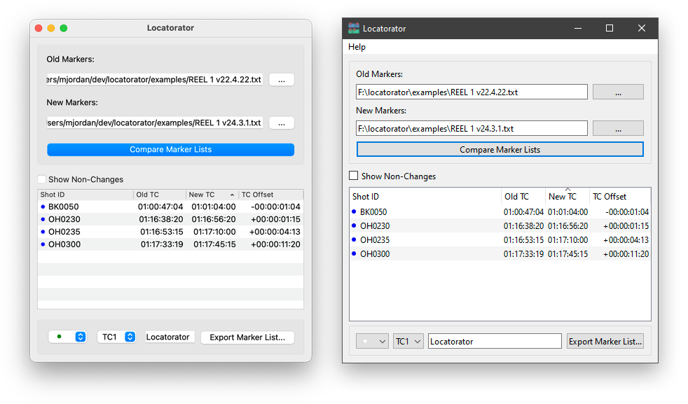

# locatorator

`locatorator` is an unfortunately-named script designed to find differences between two Avid marker lists.  For example, if a marker with a VFX ID in the comment is placed on each VFX shot, this could be helpful to determine where cut changes have occurred and which VFX shots may be affected.

`locatorator` will display the changes on-screen, as well as output a new marker list that can be imported into the new sequence to call out changes.

## Installation
### The Easy Way
Download the latest release for your OS here:
https://github.com/mjiggidy/locatorator/releases/latest

### The ~~Hard~~ Cool Way
Gently clone this repo, then install:

```bash
pip3 install /path/to/locatorator
```

Note: Due to the dependencies, I'd create a virtual environment first. But you do you.

## Usage
Once installed, two commands will be available to you:

* `locatorator` - The GUI-based program
* `locatorator_cli` - The command-line version of the program

## Screenshots


